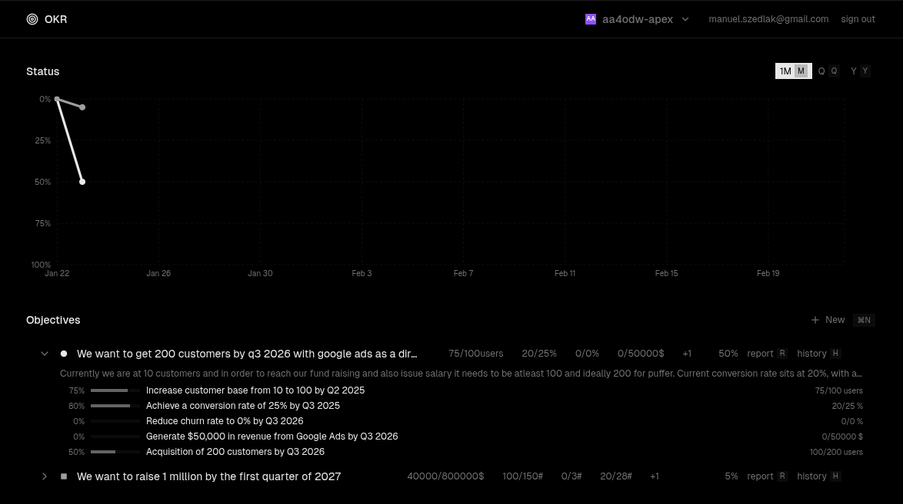

# Startup goals for your team



Set objectives, track key results, and align your team around what matters most.


## Setup

```bash
git clone https://github.com/m4nyu/okrs.git && cd okrs && npm install
```

```env
NEXT_PUBLIC_SUPABASE_URL=
NEXT_PUBLIC_SUPABASE_ANON_KEY=
SUPABASE_SERVICE_ROLE_KEY=
```

```bash
npm run dev
```

## License

[MIT](LICENSE)
